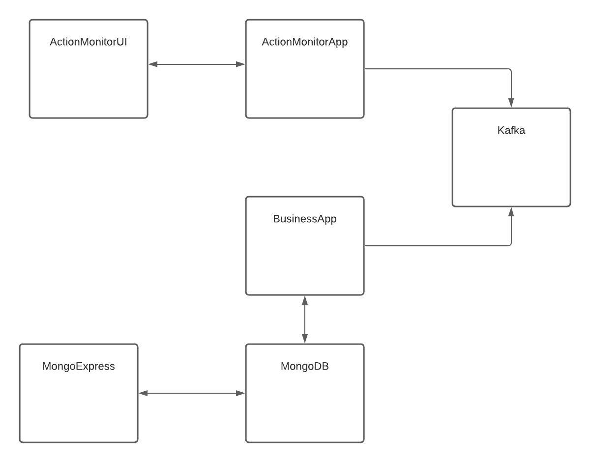

### Solution


As showed in the above diagram, architecture consists of 5 containerized components.

#### Kafka
* Contains one topic named actions. 
* BusinessApp is producing messages to mentioned topic actions.
* ActionMonitorApp is consuming messages from mentioned topic actions.

#### MongoDB
* Contains one collection named actions.
* BusinessApp creates and updates actions.

#### MongoExpress
* UI for MongoDB
* Running on http://localhost:8081/

#### BusinessApp
* REST API which is exposing two endpoints for creating and updating actions.
    ``` 
    POST /actions
    {
        "issuer": "user",
        "content": "message"
    }
    ```
    ```
    PUT /actions/{id}
    {
        "issuer": "user",
        "content": "message"
    }
    ```
* Running on http://localhost:8080/

#### ActionMonitorApp
* REST API which is exposing two endpoints for getting status and version and websocket endpoint for getting actions in realtime.
    ``` 
    GET /status
    ```
    ``` 
    GET /version
    ```
    ``` 
    WebSocket /ws/actions
    ```
* Running on http://localhost:8090/
  
#### ActionMonitorUI
* React app which displays in realtime actions by listening to websocket from `ActionMonitorApp`
* Running on http://localhost:3000/

### Setup
1. Install docker and docker-compose
1. Run `./setup.sh` (in the future `docker-compose` up but currently I've issue with one of the containers.More info inside docker.compose.yml)

note: 
* After finishing playing with apps, you can run `docker-compose down` to teardown all apps. 

### Demo
1. Open `ActionMonitorUI` by hitting http://localhost:3000/
1. Create new action by hitting http://localhost:8080/actions post endpoint with the following body:
    ```
    {
        "issuer": "user",
        "content": "message"
    }
    ```
1. Check previously opened website

### Improvements
1. !!! Add tests by using Embedded Kafka or awesome TestContainers. !!!
1. Improve Readme
1. Prepare postman queries 
1. Fix problem with too early connecting to kafka by ActionMonitorApp (docker-compose.yml)
1. Add Swagger for BusinessApp and ActionMonitorApp
1. Get rid of todo's from code
1. Add ActionType enum
1. Add timestamp to action model
1. Add specific version of dependencies 
1. Make service isolation between containers ( app-network)
1. Improve UI for `ActionMonitorUI`